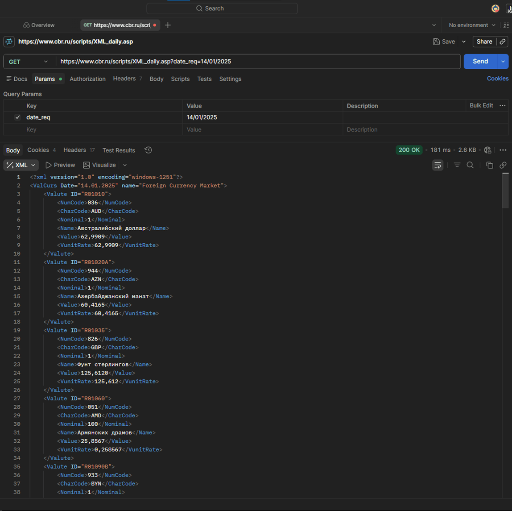
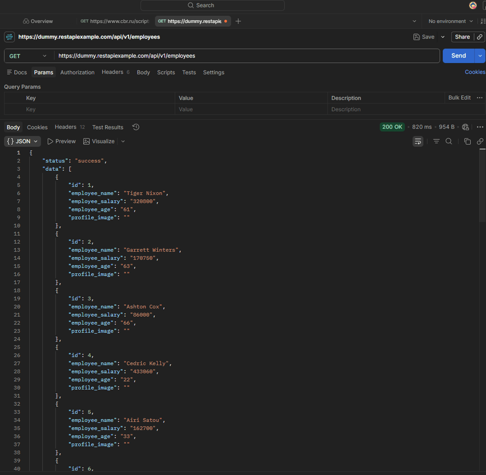
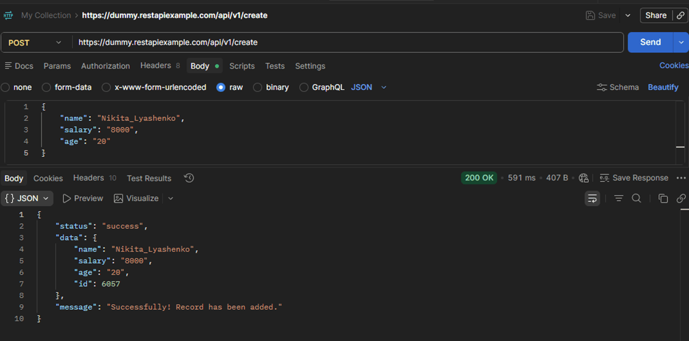

## Работа с HTTP-запросами (Postman) - Задание

### 1. GET-запрос к API Центробанка (XML)

### 2. GET-запрос: Получение списка пользователей Dummy API (JSON)

### 3. POST-запрос: Создание нового пользователя
